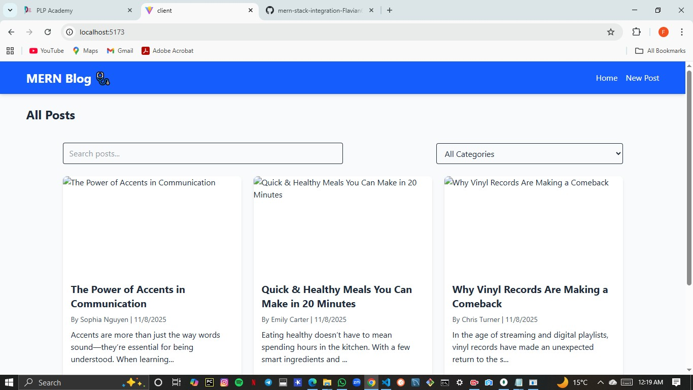
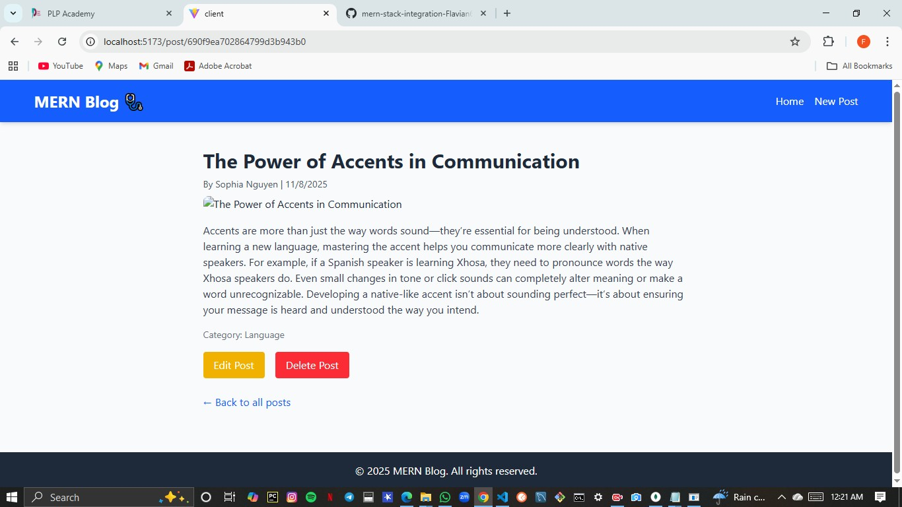
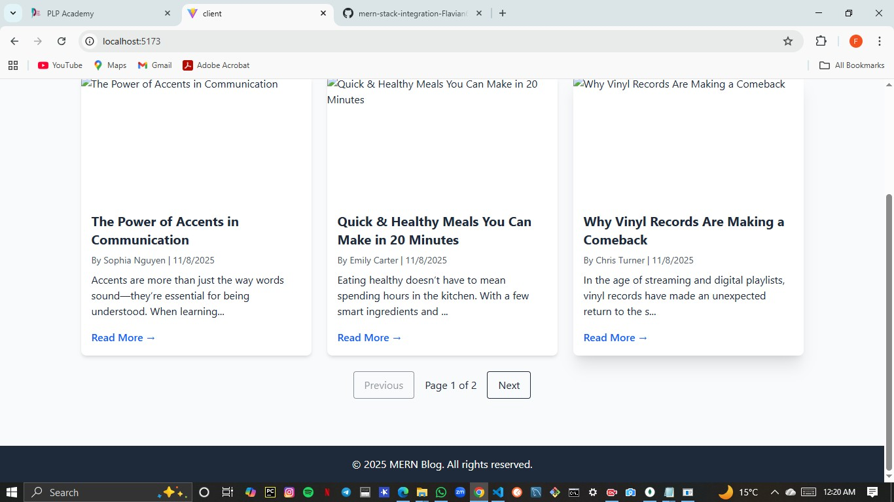

# MERN Blog

## Project Overview
**MERN Blog** is a full-stack blogging application built with **MongoDB**, **Express.js**, **React**, and **Node.js**. The application allows users to create, read, update, and delete blog posts. It also includes features like **searching, filtering by category, and pagination** for a smooth user experience.  

The frontend uses React with Tailwind CSS for a responsive and attractive UI, while the backend is built with Express.js and MongoDB.

---

## Features Implemented
- **CRUD operations for posts** (Create, Read, Update, Delete)
- **Search functionality**: Search posts by title or author
- **Filter by category**: Display posts filtered by selected category
- **Pagination**: Display 3 posts per page with navigation controls
- Responsive card layout for posts  
- Display of author name and creation date  

---


## Project Structure

```
mern-blog/
├── client/                 # React front-end
│   ├── public/             # Static files
│   ├── src/                # React source code
│   │   ├── components/     # Reusable components
│   │   ├── pages/          # Page components
│   │   ├── hooks/          # Custom React hooks
│   │   ├── services/       # API services
│   │   ├── context/        # React context providers
│   │   └── App.jsx         # Main application component
│   └── package.json        # Client dependencies
├── server/                 # Express.js back-end
│   ├── config/             # Configuration files
│   ├── controllers/        # Route controllers
│   ├── models/             # Mongoose models
│   ├── routes/             # API routes
│   ├── middleware/         # Custom middleware
│   ├── utils/              # Utility functions
│   ├── server.js           # Main server file
│   └── package.json        # Server dependencies
└── README.md               # Project documentation
```

## Project Setup

### Backend
1. Navigate to the server directory:  
   ```bash
   cd server 

2. Install dependencies:

npm install


3. Create a .env file in the server root with your MongoDB URI and port (example):

MONGO_URI=your_mongodb_connection_string
PORT=5000


4. Start the server:

npm run dev


npm run dev uses nodemon to auto-restart the server on changes.

### Frontend

1. Navigate to the client directory:

cd client


2. Install dependencies:

npm install


3. Start the React development server:

npm run dev


4. Open http://localhost:5173
 in your browser.

### API Documentation
## Posts
# Method	  Endpoint	       Description
GET	       /api/posts	       Get all posts
GET	       /api/posts/:id	   Get single post by ID
POST	     /api/posts	       Create a new post
PUT	       /api/posts/:id	   Update a post
DELETE	   /api/posts/:id	   Delete a post

# Sample POST payload:

{
  "title": "My New Post",
  "body": "This is the content of the post.",
  "author": "Jane Doe",
  "category": "Lifestyle",
  "published": true,
  "featuredImage": "default-post.jpg"
}

## Categories
# Method	  Endpoint	         Description
GET	        /api/categories	   Get all categories
POST	      /api/categories	   Create a new category

# Sample POST payload:

{
  "name": "Technology",
  "description": "Posts about tech"
}

### Screenshots 



